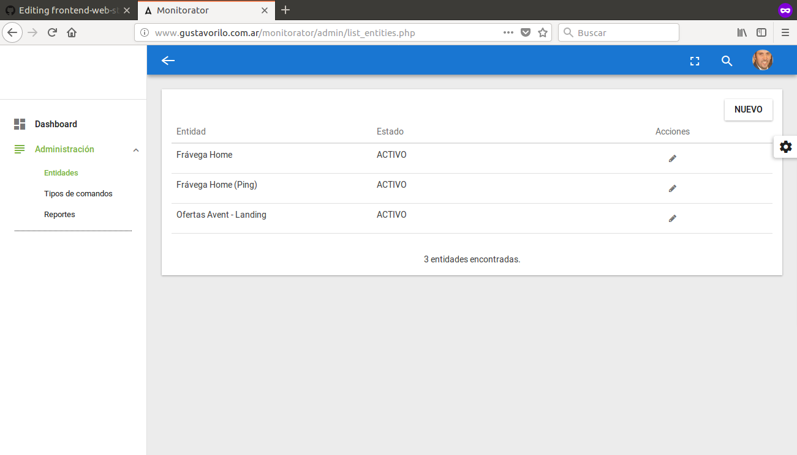

---------------------------------------------------
## MONITORATOR
---------------------------------------------------

<b>Qué es y para que sirve Monitorator</b>

Es un sistema de monitoreo por el medio del cual se pueden realizar GET / PING / CURL / TEXT IN PAGE / OTROS.

 

<b>Requerimientos para su funcionamiento</b>

Se requiere Apache + PHP + MySQL (se incluye archivo SQL - structura y datos en la folder DB)
El código se lo ha probado sobre PHP Version 5.3.24 y MySQL 5.5

*<b>IMPORTANTE:</b> 
Se necesita utilizar un cron para llamar al archivo cron.php (recomendamos que el cron se ejecute cada 5 minutos, todos los días, todo el año; de todas maneras esto es en base a necesidad). Ejemplo de nuestra sugerencia:

<b>*/5 * * * * php /var/www/html/monitorator/admin/cron.php</b>*

---------------------------------------------------

Desarrollado en 2017.
Contacto: gustavo.rilo@gmail.com

---------------------------------------------------
