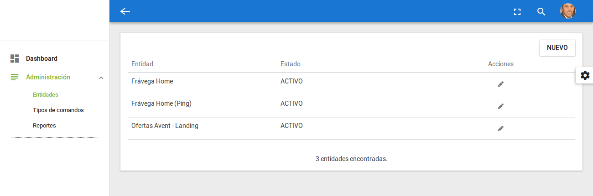

---------------------------------------------------
## MONITORATOR
---------------------------------------------------

<b>Qué es y para que sirve Monitorator</b>

Es un sistema de monitoreo por el medio del cual se pueden realizar GET / PING / CURL / TEXT IN PAGE / OTROS.

 

<b>Requerimientos para su funcionamiento</b>

Se requiere Apache + PHP + MySQL (se incluye archivo SQL - structura y datos en la folder DB)

---------------------------------------------------

Desarrollado en 2017.
Contacto: gustavo.rilo@gmail.com

---------------------------------------------------
